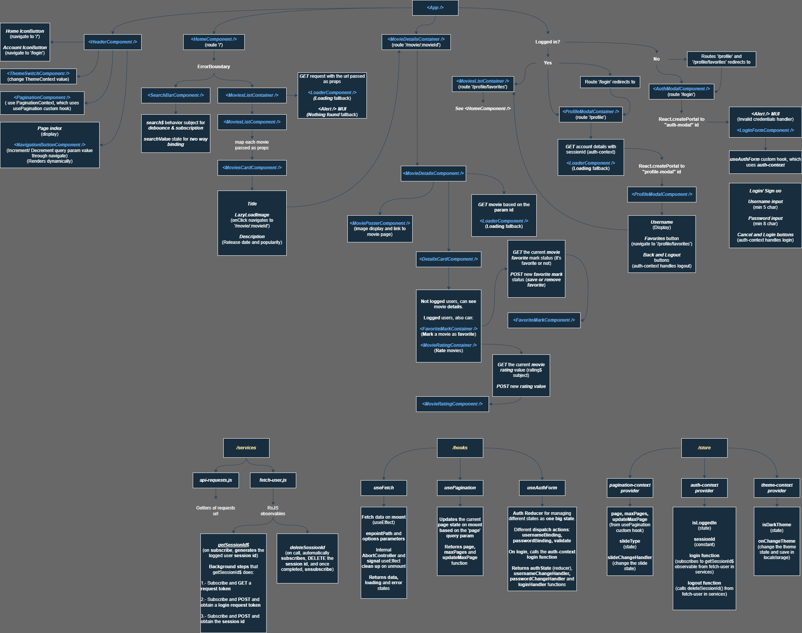

# Project set-up

Create a '.env' file in the same location as '.env.example' file.

## '.env' file set-up

Once created, copy and paste the content of '.env.example' to your '.env', \
and change '<<API_KEY>>' to a valid TMDB API KEY.

## How to obtain TMDB API KEY?

1.- Login or Sign up to (https://www.themoviedb.org) \
2.- Go to account settings -> API -> API Key (v3 auth) \
3.- Copy and paste it on '.env' 

### Demo Diagram

